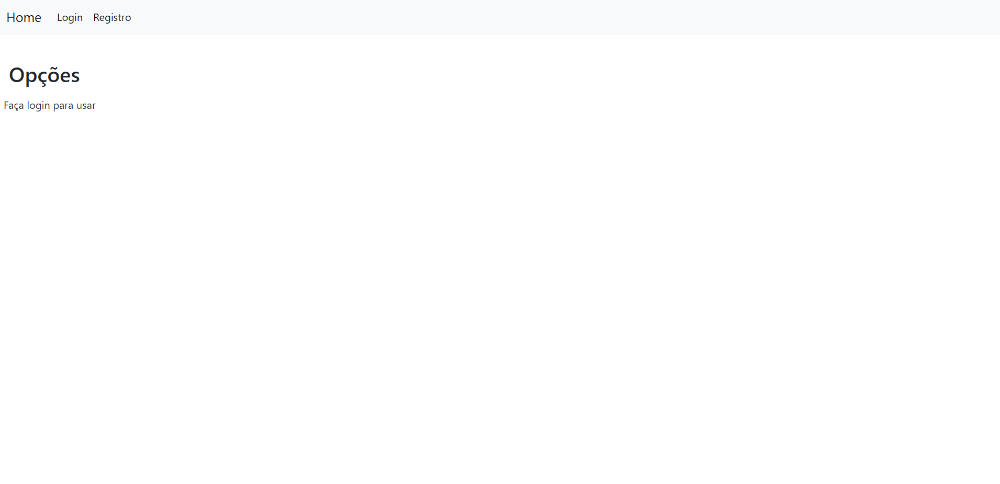
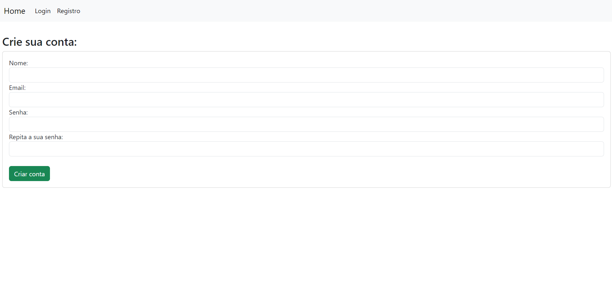

# Projeto: Controle de estoque para abrigos

Acesso: https://estoque2024-492b6860c2a5.herokuapp.com/

### Desenvolvedores
Marcos Noble, Ivan Maidana e Matheus de Almeida

Curso: Ciência da Computação

### Acesso como Administrador

Para realizar retiradas parciais, e controle de acesso dos usuarios. 
Usuario: admin@admin  
Senha: admin

### Nosso produto

Desenvolvemos uma plataforma completa de gerenciamento de estoque de alimentos, voltada para categorizar itens da cesta básica. Esta solução permite que o gerente adicione, exclua ou doe alimentos no estoque de forma eficiente e controlada. O sistema possui controle de acesso, garantindo que apenas administradores autenticados possam acessar e gerenciar as informações. Além disso, há uma funcionalidade de cadastro de novos usuários, permitindo que novos membros possam acessar e gerenciar o estoque.

### Desenvolvimento

O desenvolvimento do projeto se deu em algumas etapas, e decisões foram tomadas para garantir a criação de um sistema funcional.

Primeiramente, visitamos inúmeros sites, vídeos e imagens relacionadas a sistemas de controle de estoque, para verificar como era a interface, a forma como eram apresentados os itens estocados e como era feita a inserção, exclusão e doação. Posteriormente, decidimos o estilo e o banco de dados que iríamos utilizar, que foi o MongoDB, pela facilidade de alteração, por ser uma plataforma online e gratuita. Em seguida, decidimos a estrutura que o banco teria.

A implementação foi feita em Node.js com a ajuda da biblioteca Express-handlebars, que é um mecanismo de visualização (template engine) para a estrutura de aplicação web Express.js, permitindo a criação de templates dinâmicos e reutilizáveis. Ele utiliza a linguagem de template Handlebars, que combina HTML com expressões embutidas, avaliadas e substituídas por dados fornecidos ao template.

#### Tecnologias

- HTML
- CSS
- Javascript
- node JS
- Express
- Express-handlebars
- Mongo DB
- Mongoose
- Bcryptjs

#### Ambiente de desenvolvimento

- Nodemon 
- VS Code (Tema: Dracula Official)
- Extensões:
    Git Graph
    Auto Close Tag

#### Referências e créditos

- [Curso de Node.JS](https://www.youtube.com/watch?v=LLqq6FemMNQ&list=PLJ_KhUnlXUPtbtLwaxxUxHqvcNQndmI4B&index=2)
- [chart GPT](https://chatgpt.com/)

---
Projeto entregue para a disciplina de [Desenvolvimento de Software para a Web](http://github.com/andreainfufsm/elc1090-2024a) em 2024a

